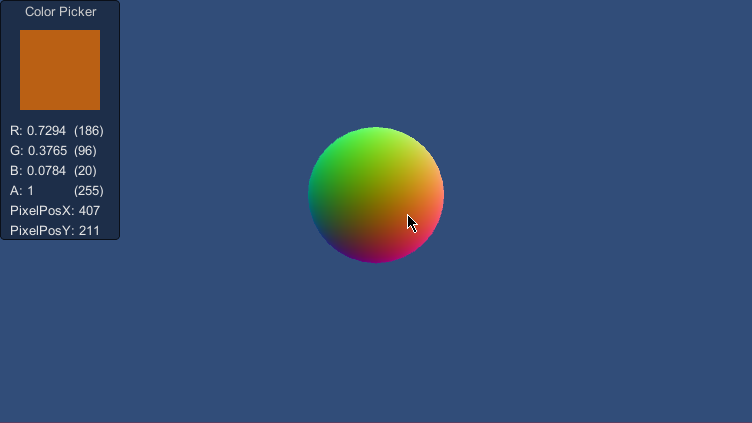
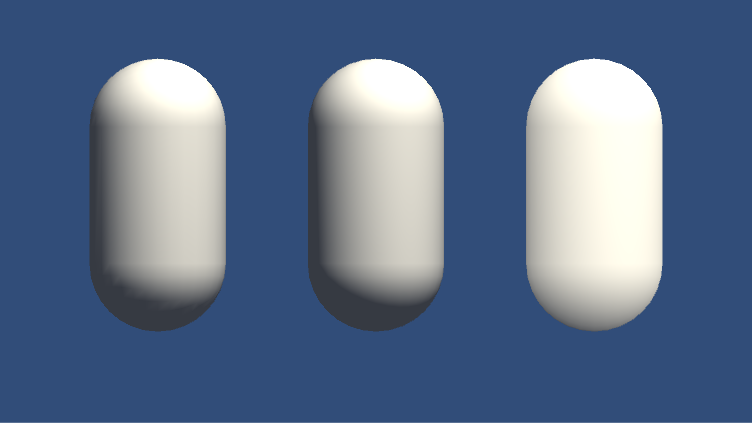
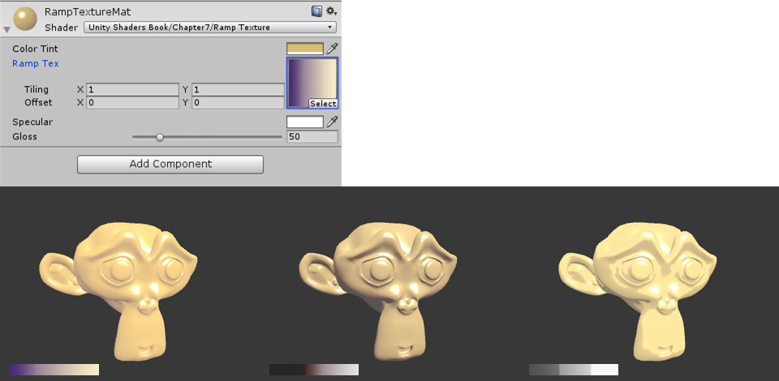
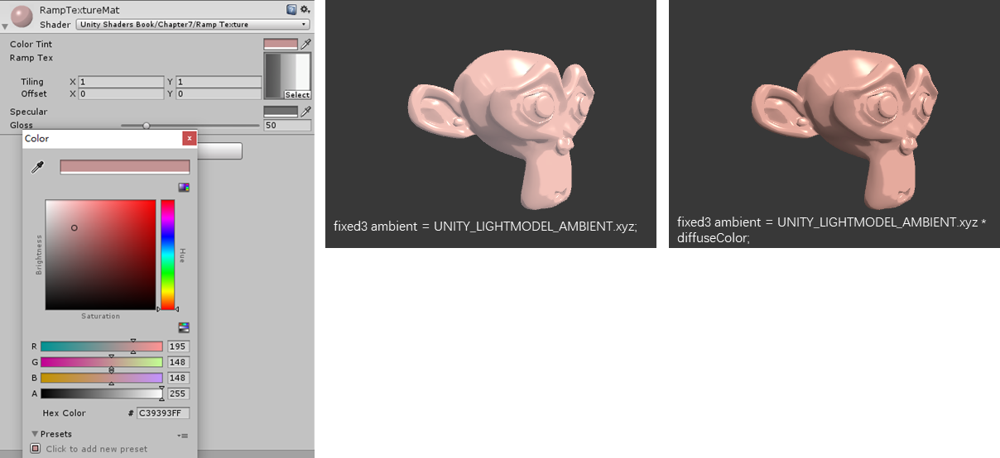
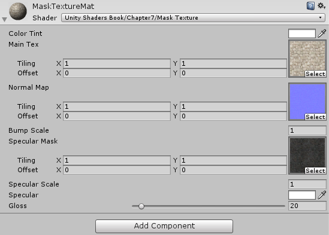

# UnityShaderBeginner
读《Unity Shader 入门精要》

## 基础篇

### 第 1 章 欢迎来到 Shader 的世界

### 第 2 章 渲染流水线

### 第 3 章 Unity Shader 基础

### 第 4 章 学习 Shader 所需的数学基础

## 初级篇

### 第 5 章 开始 Unity Shader 学习之旅

**用假颜色对Unity Shader进行调试，并且使用颜色拾取器来查看调试信息**



> Chapter5-FalseColor.shader <br>
> ColorPicker.cs

### 第 6 章 Unity 中的基础光照

**逐顶点漫反射光照、逐像素漫反射光照、半兰伯特光照的对比效果**



> Chapter6-DiffuseVertexLevel.shader <br>
> Chapter6-DiffusePixelLevel.shader <br>
> Chapter6-HalfLambert.shader


**逐顶点的高光反射光照、逐像素的高光反射光照（Phong光照模型）和Blinn-Phong高光反射光照的对比结果**


> Chapter6-SpecularVertexLevel.shader <br>
> Chapter6-SpecularPixelLevel.shader <br>
> Chapter6-BlinnPhong.shader <br>
> Chapter6-BlinnPhongUseBuildInFunction.shader（与上面的相同效果）

### 第 7 章 基础纹理

#### 7.1 单张纹理

**用一张纹理来替代物体的漫反射颜色，使用 Blinn-Phong光照模型计算光照。**

**[TODO] Add Images**

> Chapter7-SingleTexture.shader <br>
> Scene_7_1.unity


**纹理的属性：Tilling & Offset，Wrap Mode，Mipmap，Filter Mode，等。**

**[TODO] Add Images**

> Chapter7-TextureProperties.shader <br>
> Scene_7_1_2_a.unity <br>
> Scene_7_1_2_b.unity <br>
> Scene_7_1_2_c.unity

#### 7.2 凹凸映射

凹凸映射主要可以通过两种方式来实现：高度纹理，法线纹理。

法线纹理中存储的法线方向在哪个坐标空间中？可以是：模型空间的法线纹理，切线空间的法线纹理。

需要在计算光照模型中统一各个方向矢量所在的坐标空间。可以是：切线空间下的光照计算，世界空间下的光照计算。

**使用 Bump Scale 属性来调整模型的凹凸程度**


>Chapter7-NormalMapTangentSpace.shader

#### 7.3 渐变纹理 

**使用渐变纹理控制物体的漫反射光照**



```c++
// 漫反射颜色的计算（使用半兰伯特模型计算的值构建纹理坐标对渐变纹理进行采样）
fixed halfLambert = dot(worldNormal, lightDir) * 0.5 + 0.5;
fixed3 diffuseColor = tex2D(_RampTex, fixed2(halfLambert, halfLambert)).rgb * _Color.rgb;
fixed3 diffuse = _LightColor0.rgb * diffuseColor;
```

> Chapter7-RampTexture.shader

有个疑问，计算 ambient 时，需不需要乘上 diffuseColor。因为 **7.1 单张纹理** 中有 `fixed3 ambient = UNITY_LIGHTMODEL_AMBIENT.xyz * albedo; `。很疑惑。。。



#### 7.4 遮罩纹理

使用高光遮罩纹理，逐像素地控制模型表面的高光反射强度。





**小Tips**：主纹理、法线纹理和遮罩纹理共同使用一个纹理属性变量 `_Main_Tex_ST`，这样，在材质面板中修改主纹理的平铺和偏移系数会同时影响3个纹理的采样（起到同步的作用），并且可以节省存储的纹理目标数。

> Chapter7-MaskTexture.shader <br>
> Chapter7-MaskTexture_v2.shader


